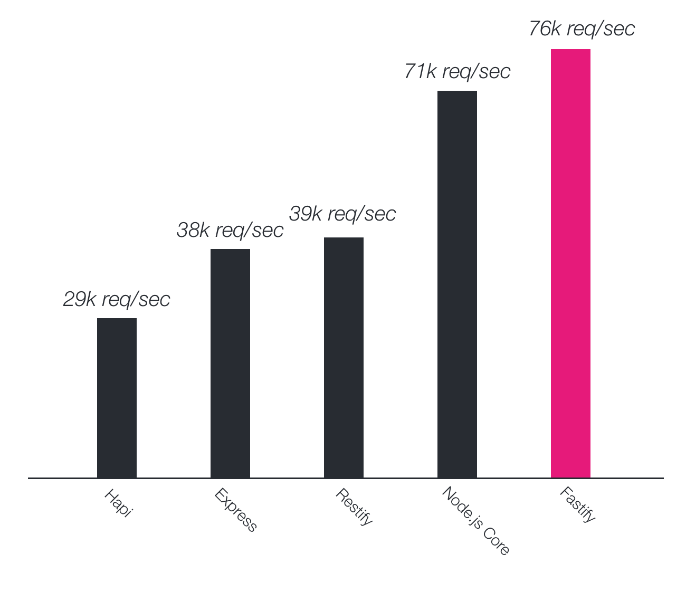

<!--
bodyclass intro-background
class border-left copyright-right intro-title
-->

# MONOLITHS<br/>ALWAYS<br/>PAY THEIR<br/>DEBTS

[@delvedor](https://twitter.com/delvedor)

---
<!--
class center center-image copyright-right
-->


[@delvedor](https://twitter.com/delvedor)

---
<!--
class small
-->


---

# Let's *build* our new startup*!*

---
<!--
class small colored-li
-->

# Let's *build* our new startup!
Let's build the next billion dollar startup, *Moo*!

Basically Twitter, but with more characters and *cows*.

A user should be able to:
- Signup!
- Post a new moo
- Get a post by id
- Get all the posts of a user

---
<!--
class small
-->

### Let's *build* our new startup!
The API will expose three different services, *login*, *post* and *user*.

```txt
/signup
/post/:id
/post/create
/user/:username/posts
```
---
<!--
bodyclass fastify-background
class copyright-right
-->


[fastify.io](http://fastify.io/)

---
<!--
class copyright-right
-->

```js
const fastify = require('fastify')()

fastify.get('/', async (request, reply) => {
  return { hello: 'world' }
})

fastify.listen(3000)
```

[fastify.io](http://fastify.io/)

---
<!--
class center benchmarks-image
-->




---
<!--
class small code-line-height
-->

# A little bit of configuration
Being *consistent* across microservices is a difficult task,<br/>to *help you* Fastify provides a powerful CLI.

```bash
npx fastify generate moo-project
cd moo-project
npm install
```

---
<!--
class small
-->

# Project structure
- *app.js*: your entry point;
- *services*: the folder where you will declare all your endpoints;
- *plugins*: the folder where you will store all your custom plugins;
- *test*: the folder where you will declare all your test.

---
<!--
class small
-->

# Scripts
- *`npm start`*: run your server;
- *`npm run dev`*: run your server with pretty logs
(not suitable for production);
- *`npm test`*: run your test suite.

---
<!--
bodyclass hack-background
class white-text nobreak
-->

# “Let's the hack begin”

---
<!--
class small
-->

# Let's take a look at our *monolith*

---
<!--
class demo center
-->

<span style="color: #757575; font-style: italic;">// demo</span>

---


---
<!--
class center
-->

# Monolith vs Microservices


---
<!--
class nobreak
-->

# Fastify *Plugins*
A brief overview

---

```js
fastify.register(
  require('my-plugin'),
  { options }
)
```

---
<!--
class row async-plugin
-->

```js
function myPlugin (fastify, opts, next) {
  // register other plugins
  fastify.register(...)

  // add hooks
  fastify.addHook(...)

  // add decorator
  fastify.decorate(...)

  // add routes
  fastify.route(...)

  next()
}

module.exports = myPlugin
```

### *async await*<br/>is supported as well!

---
<!--
class center small-image
-->

# Plugins: *Architecture*


---
<!--
class center small-image
-->

# Plugins: *Encapsulation*


---

### Exposing functionality to *parents*
```js
const fp = require('fastify-plugin')

async function myPlugin (fastify, options) {
  fastify.decorate('util', yourAwesomeUtility)
  // now you can use it with `fastify.util`
}

module.exports = fp(myPlugin)
```

---
<!--
class center small-image
-->

# Plugins: *Encapsulation*


---
<!--
class center small-image
-->

# Plugins: Real world


---

### *Encapsulation* enables many great things
### such as custom `log-level` per plugin

<br/>

```js
const fastify = require('fastify')()

fastify.register(require('./api/v1'), {
  prefix: '/v1',
  logLevel: 'error'
})

fastify.register(require('./api/v2'), {
  prefix: '/v2',
  logLevel: 'debug'
})
```
---
<!--
class boxed-em
-->

# *Everything* is a plugin

---

# From monolith to *microservices*
### Let's begin*!*

---
<!--
class demo center
-->

<span style="color: #757575; font-style: italic;">// demo</span>

---


---
<!--
class clients center
-->

# Awesome!
Now update *all your clients* so they know which address to call based on the service they need to use.


---
<!--
class boxed-em
-->

# *WRONG!*

---
<!--
class small
-->

# The infrastructure<br/>should be *transparent*<br/>to the client.

---
<!--
class small nobreak
-->

How can we *fix* this*?*

---
<!--
class small
-->

# Gateway*.*

---

```bash
npm install fastify-http-proxy
```

```js
fastify.register(require('fastify-http-proxy'), {
  upstream: 'http://localhost:3030',
  prefix: '/post'
})
```

---
<!--
class demo center
-->

<span style="color: #757575; font-style: italic;">// demo</span>

---
<!--
class gateway-image center
-->


---
<!--
bodyclass fastify-background
class copyright-right
-->


[fastify.io](http://fastify.io/)

---
<!--
bodyclass fastify-background
class copyright-right small white-text
-->

# Thanks!

[@delvedor](https://twitter.com/delvedor)
